# Why the trained model has differnt performance in different fold?

A disscussion about the false prediction with the trained model, for ASD and non-ASD.

---

## Abstract

Up to now, we proposed a two stage method to predict the ASD and non-ASD, which all of them are spinal disease.

We want to capture the motion changes in frames, to help the doctor to analysis the spinal disease.

But, the trained model has false prediction (miss classification), which means the trained model can not predict the spinal disease correctly.

So why the trained model will have false prediction?
Is there have some reason for the false prediction?

In this document, we will analysis the false prediction, to find the reason why the trained model has false prediction.

## Data distribution

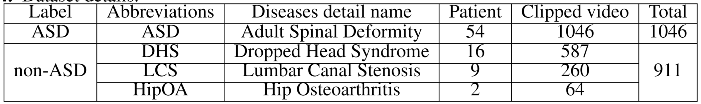

 Data distribution 

In this study, we use the 5-fold cross validation to train and validate the model.

Generally machine learning divides the dataset into three parts: training set, validation set and test set.
However, based on our relatively small dataset, we did not divide the whole dataset into a separete test set.
Instead, we used the 5-fold cross validation to train and validate the model, to obtain a more stable and generalizable results.

When experimenting, we ensured that the same patient did not appear simultaneously in the training set and the validation set.
In addition, the balance of the paitents among the folds is a significant problem.
Here, we used a method called stratified group cross-validation. 
This ensured that the number of patients was balanced and taht the same patient did not repeat the training and validation datasets.

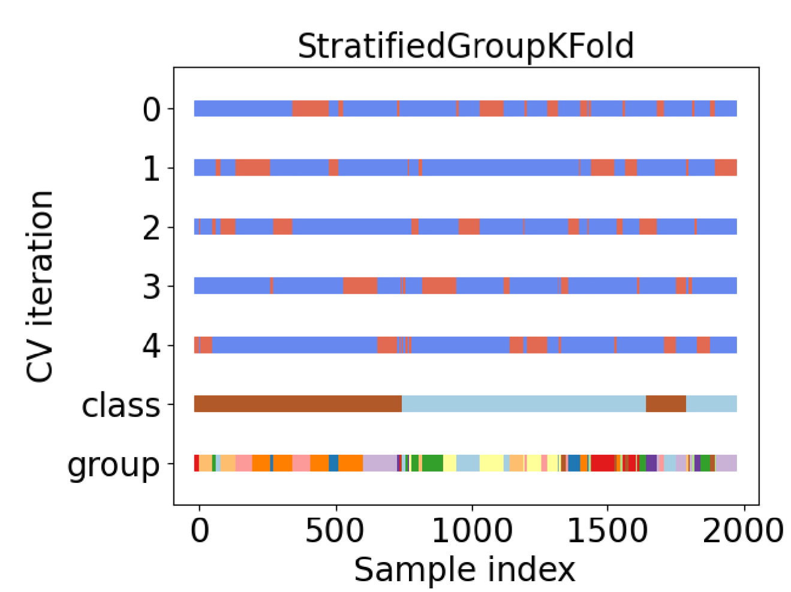

 5-fold stratified group cross validation for our gait video dataset 

Here shows the data distribution after 5-fold stratified group cross validation.
We used the API from scikit-learn toolkit to split the dataset into 5 folds, and had a balanced dataset for our experiment.

We also want to find a way to visualize the data distribution.

## Method

In the training experiment, we use the 5-fold cross validation to train the model.

It means that there will have 5 different trained model (aka, checkpoint), and each trained model will have different predict metrics.

For the experiment 515_1_8_resnet_depth50 verion, we get the predict accuracy as follow:

| Fold | validation loss | Accuracy | Precision | Recall | F1-score | AUROC  |
| ---- | --------------- | -------- | --------- | ------ | -------- | ------ |
| 0    | 1.82            | 0.7008   | 0.8551    | 0.5814 | 0.6922   | 0.7555 |
| 1    | 1.06            | 0.6735   | 0.6723    | 0.6219 | 0.6461   | 0.7050 |
| 2    | 1.17            | 0.6958   | 0.6133    | 0.4677 | 0.5307   | 0.7170 |
| 3    | 0.23            | 0.9077   | 0.9078    | 0.8596 | 0.8830   | 0.9594 |
| 4    | 0.81            | 0.8106   | 0.8155    | 0.7053 | 0.7564   | 0.8431 |
| Mean | Nan             | 0.7553   | 0.7850    | 0.6420 | 0.7063   | 0.7864 |

 The predict metrics of different fold. 

The mean value of the predict metrics is the final predict metrics for the trained model, reported in the paper.

In this table, we can see that the trained model in fold 1 has the best predict metrics, and the trained model in fold 5 has the worst predict metrics.

## Confusion matrix

The confusion matrix of different fold is as follow:

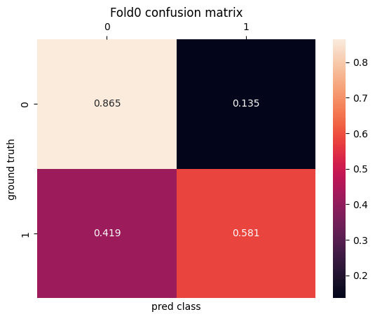
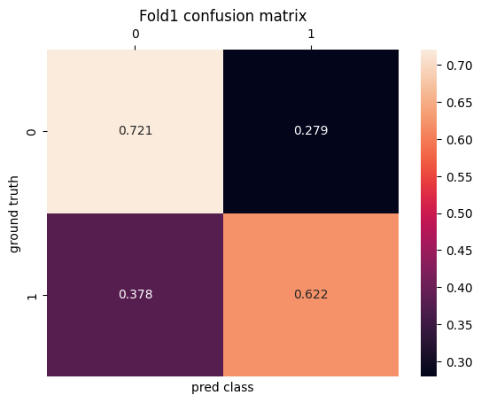
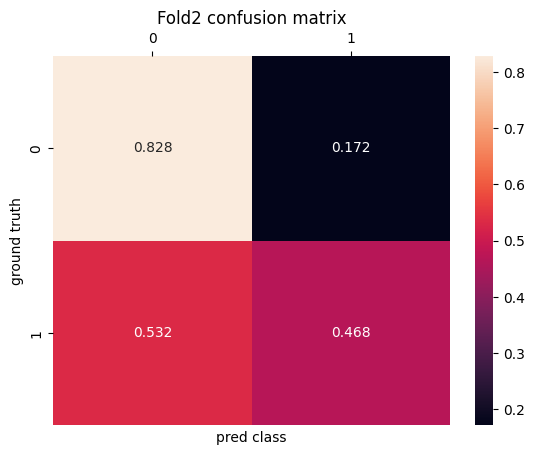
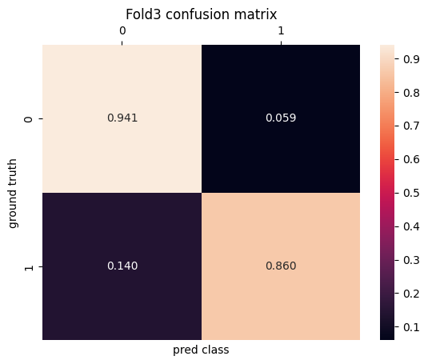
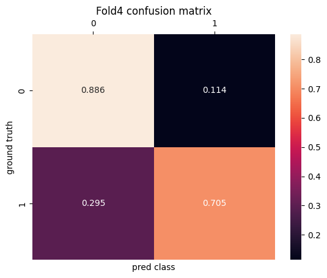

The final confusion matrix is as follow:

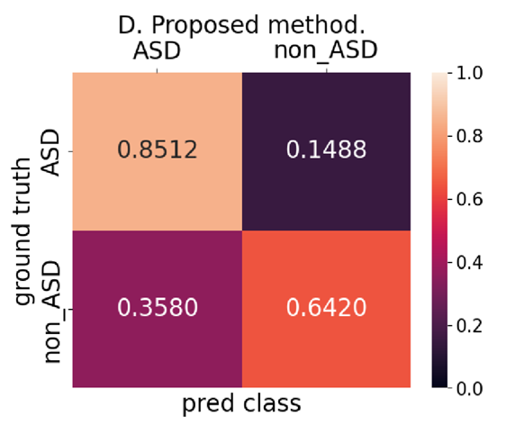

 The confusion matrix of whole dataset. The results are mean across 5-fold. 

## Class Attention Map

In image classification tasks, a class attention map may highlight which regions or features of an input image are most important for the model to make a specific class prediction. This can help interpret why a model made a certain decision.

This time, We use Grad-CAM (Gradient-weighted Class Activation Mapping) to generate class attention maps in convolutional neural networks (CNNs).

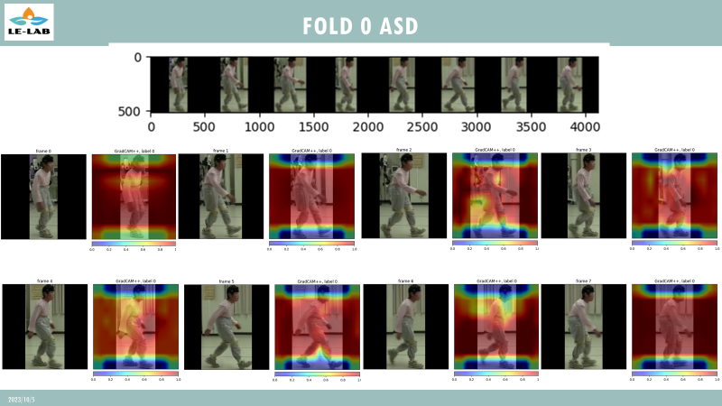
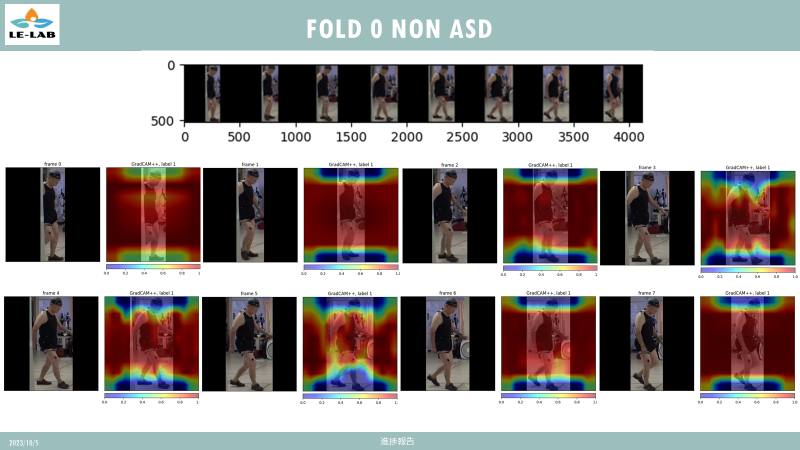
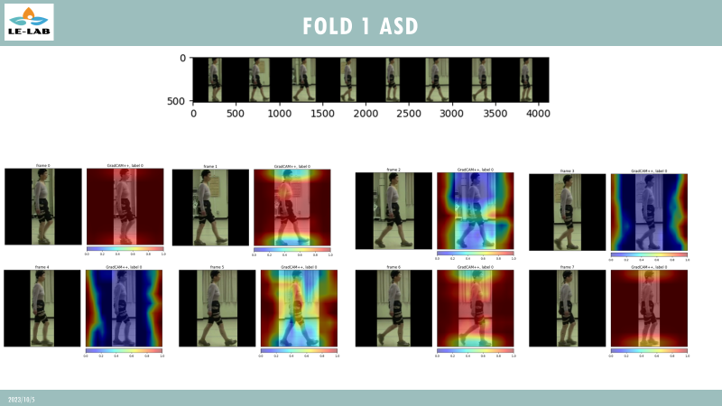
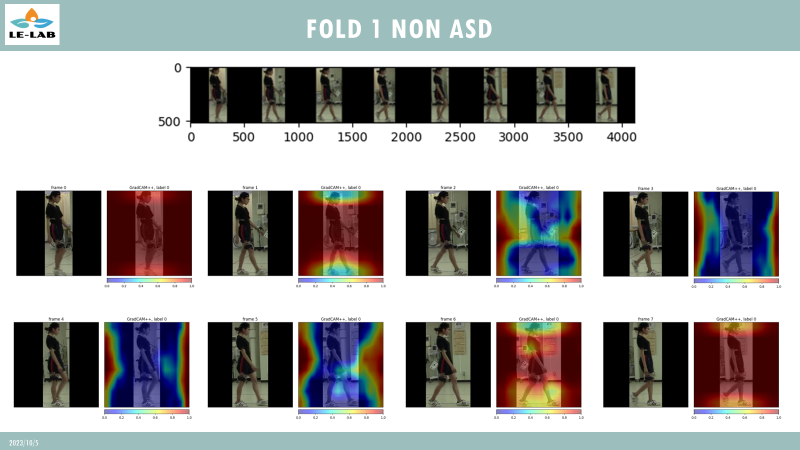
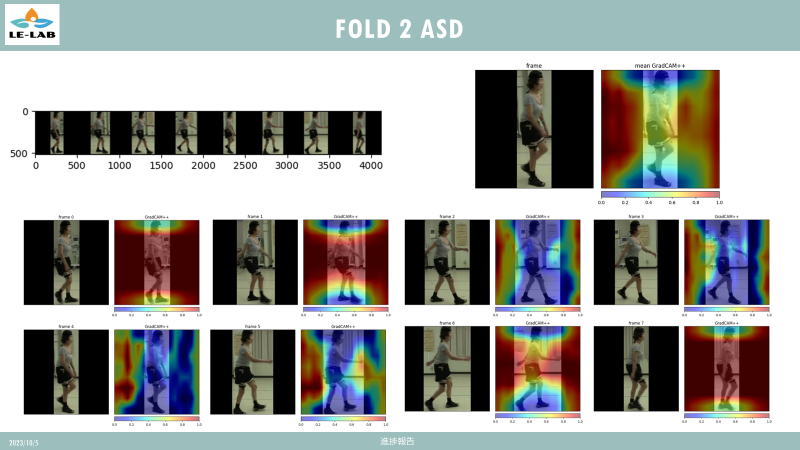
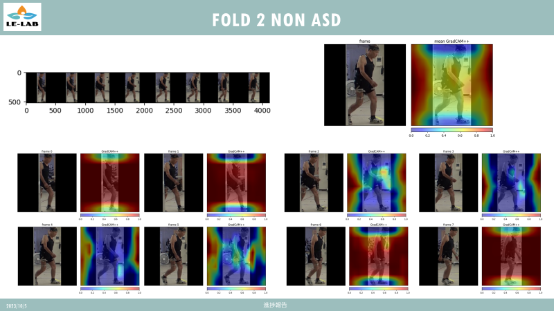
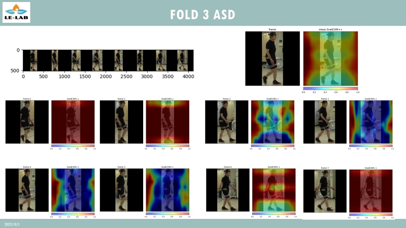
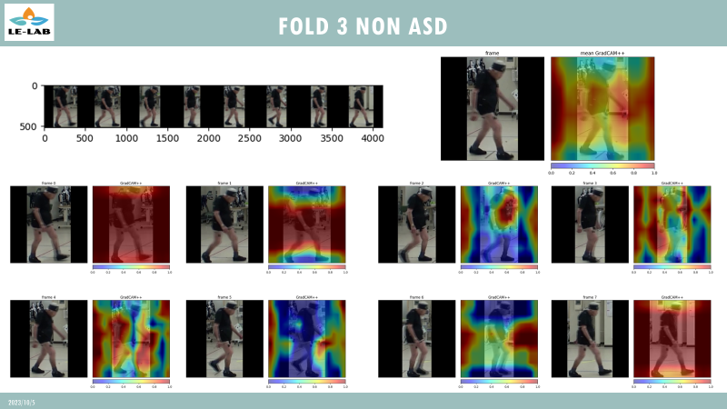
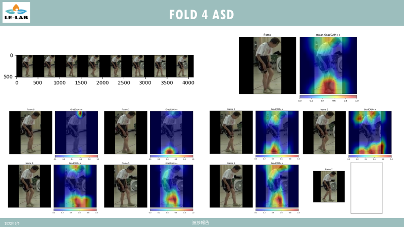
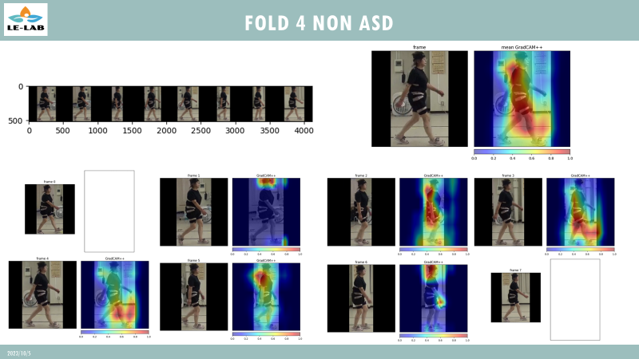

## What is the difference between the different folds?

We ensure the same patient did not appear simultaneously in the training set and the validation set.
The difference between the different folds is the different patients in the training set and the validation set.

But we do not think this is the reason for the different performance of the different folds.
Becaues if the model can extract the features of the spinal disease, the model can predict the spinal disease correctly, no matter which patient is in the training set or the validation set.

The only reason we think is the model is not complex enough to extract the features of the spinal disease.

For example, for ASD, we want the model pay more attention to the spine area, not the other parts (e.g., head, foot).
But the model can not extract the features from the correct location, such as the spine area.
So the model will pay more attention to the other parts, less relevant to the disease.

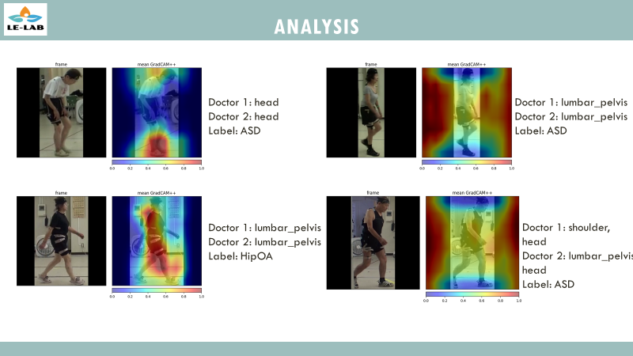

 Compareation between two doctors observation results and CAM. 

Here shows the compareation between two doctors observation results and CAM.

The left column is the 
higher metrics, the model will pay more attention to the patient's body, and area is similar to the doctor's observation results.

The right column is the lower metrics, the model will pay more attention to the irrelevant parts, and the area is not similar to the doctor's observation results.
So, we can found that the model can not extract the features from the correct location.

## How to improve the performance of the model?

Here, we list some possible solutions to improve the performance of the model.

1. Forcing the model to focus where it should.
2. Inject information that is linked to the disease.
3. Enhance model capabilities.
